# 2023云原生大作业文档

> Produced by Group `NJU33`

## 小组成员及分工

|  姓名  |   学号    |                             分工                             |
| :----: | :-------: | :----------------------------------------------------------: |
| 张哲恺 | 211250245 | 完善接口代码及`Dockerfile`，提供`Prometheus`接口，编写`Kubernetes`编排文件，编写`Jenkins`流水线脚本，实现`Grafana`大屏监测，压力测试 |
| 杨海涛 | 211250195 |                  编写接口代码及`Dockerfile`                  |
| 刘汉弈 | 211250211 |                                                                 |
| 胡立涛 | 211250241 |                        完善`Dockerfile`，实现基于HPA管理的Pod水平自动扩缩                                              |

## 功能截图与说明

### 功能要求

#### 接口代码

~~~~java
// HelloController.java
@GetMapping("/hello")
@ResponseStatus(HttpStatus.OK)
public Object sayHello() {
    if (bucket.tryConsume(1)) {
        JSONObject jsonObject = new JSONObject();

        jsonObject.put("gid", "033");
        jsonObject.put("name", "结束乐队");
        jsonObject.put("members", "Corax, Begonia, Logician, LittleHu");
        jsonObject.put("msg", "hello");

        return jsonObject;
    } else {
        throw new TooManyRequestException(ErrorType.TOO_MANY_REQUEST);
    }
}
~~~~

该部分接口代码实现了对HTTP的GET请求返回JSON信息:

~~~~json
{
  "gid" : "033",
  "name" : "结束乐队",
  "members" : "Corax, Begonia, Logician, LittleHu",
  "msg" : "hello"
}
~~~~

同时进行了限流处理，具体信息将在下一节详细说明

#### 限流功能

首先在`pom.xml`中添加限流依赖：

~~~~xml
<dependency>
    <groupId>com.github.vladimir-bukhtoyarov</groupId>
    <artifactId>bucket4j-core</artifactId>
    <version>7.6.0</version>
</dependency>
~~~~

代码的关键部分如下所示：

~~~~java
// HelloController.java
private final Bucket bucket;
public HelloController() {
    Bandwidth limit = Bandwidth.classic(10, Refill.greedy(10, Duration.ofMinutes(1)));
    this.bucket = Bucket.builder().addLimit(limit).build();
}

// BizExceptionHandler.java
@ExceptionHandler(TooManyRequestException.class)
@ResponseStatus(HttpStatus.TOO_MANY_REQUESTS)
public Object handleToManyRequestException(TooManyRequestException e) {
    System.err.println(e.getMessage());

    JSONObject jsonObject = new JSONObject();
    jsonObject.put("msg", "too many request");

    return jsonObject;
}

// TooManyRequestException.java
public TooManyRequestException(ErrorType type) {
    this.message = type.getMessage();
    this.code = type.getCode();
    this.httpCode = type.getHttpCode();
}

// ErrorType.java
TOO_MANY_REQUEST(100001, "to many request", HttpStatus.TOO_MANY_REQUESTS.value());
~~~~

以上的代码合作实现了单节点的限流功能，在`HelloController`构造时为其创建一个每分钟10次的限制（为测试方便并没有设置成每秒100次，并且个人认为每分钟100次都已经相当有`DDoS`攻击的嫌疑了），在每次接收到/hello的请求后就消耗一次，如果已经满10次就抛出自定义的异常，交由Exception Handler处理，处理方式是返回表示请求过多状态码（后面的`JSON`实际上没有意义）

#### 接口访问指标

在`pom.xml`文件中添加以下内容：

~~~~xml
<!-- prometheus -->
<dependency>
    <groupId>org.springframework.boot</groupId>
    <artifactId>spring-boot-starter-actuator</artifactId>
</dependency>
<dependency>
    <groupId>io.micrometer</groupId>
    <artifactId>micrometer-registry-prometheus</artifactId>
</dependency>
~~~~

并在`application.properties`文件中添加以下内容：

~~~~properties
server.address = 0.0.0.0
server.port = 8080

server.servlet.encoding.charset=utf-8
server.servlet.encoding.force=true
server.servlet.encoding.enabled=true
######################################################################################
# content below is critical information, content above is for following explaination #
# access prometheus data by url + /actuator/prometheus                               #
######################################################################################
management.endpoints.web.exposure.include=prometheus
management.endpoint.prometheus.enabled=true
management.metrics.export.prometheus.enabled=true
~~~~

然后在程序运行的过程中即可通过 http://127.0.0.1:8080/actuator/prometheus 查看系统资源占用及运行信息

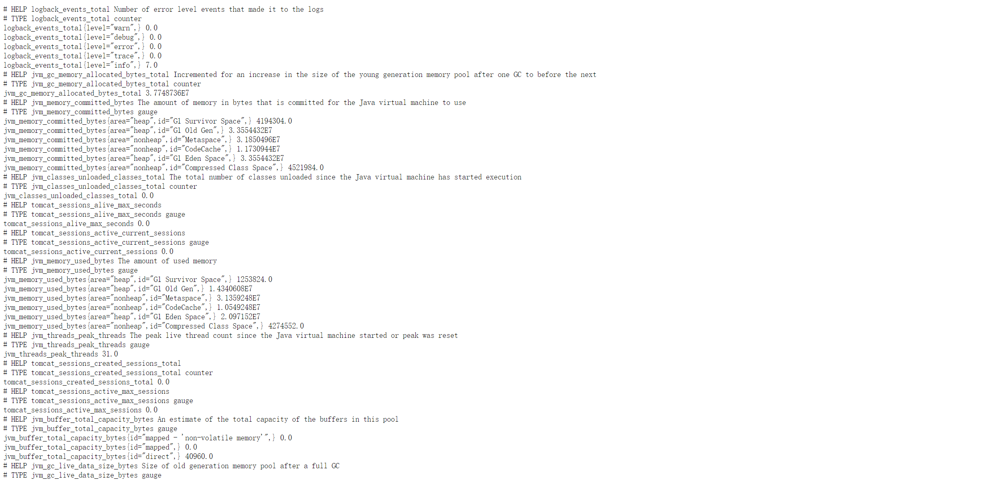

#### 统一限流

> TBD

在分布式集群中，一个节点只能对自己限流，因此实现统一限流的方式是在更高层的`Nginx`或`Tomcat`进行相应的配置

### DevOps要求

#### 使用Dockerfile构建镜像

~~~~dockerfile
FROM openjdk:11

COPY ./target/hello-service-0.0.1-SNAPSHOT.jar /app/hello-service.jar

WORKDIR /app

EXPOSE 8080

ENTRYPOINT ["java", "-jar", "hello-service.jar"]
~~~~

上面的`Dockerfile`从`openjdk:11`的基础镜像开始构建，以提供Spring Boot项目运行所需要的java环境

然后将打包好的jar包复制到容器的/app目录下，设置工作目录为/app，对外暴露8080端口

最后运行jar包中的Spring Boot项目

#### Kubernetes编排文件

~~~~yaml
apiVersion: apps/v1
kind: Deployment
metadata:
  labels:
    app: hello-server
  name: hello-server
  namespace: nju33
spec:
  replicas: 1
  strategy:
    type: RollingUpdate
    rollingUpdate:
      maxSurge: 25%
      maxUnavailable: 25%
  selector:
    matchLabels:
      app: hello-server
  template:
    metadata:
      annotations:
        prometheus.io/path: /actuator/prometheus
        prometheus.io/port: "8080"
        prometheus.io/scheme: http
        prometheus.io/scrape: "true"
      labels:
        app: hello-server
    spec:
      containers:
        - image: harbor.edu.cn/nju33/hello-server:{VERSION}
          name: hello-server
---
apiVersion: v1
kind: Service
metadata:
  name: hello-server
  labels:
    app: hello-server
spec:
  type: NodePort
  selector:
    app: hello-server
  ports:
    - name: tcp
      protocol: TCP
      port: 8080
      targetPort: 8080
~~~~

上面的编排文件实现了：

**Deployment：**在`nju33`名空间下hello-server的部署，实现了滚动发布，为了后续扩容方便节点数暂时设置为1，并添加了`prometheus`需要的注解，镜像为`harbor.edu.cn/nju33/hello-server:{VERSION}`（`{VERSION}`的作用将配合Jenkins流水线脚本说明）

**Service：**在名空间`nju33`下hello-server的服务，容器内需要进行映射的服务端口为8080

#### Jenkins流水线脚本

~~~~groovy
pipeline{
    agent none

    stages {
        stage('Clone Code') {
            agent {
                label 'master'
            }
            steps {
                echo "1. Starting to clone code from Github (may fail for several times ...)"
                // TODO: add your own username and password here
                sh 'curl "http://p.nju.edu.cn/portal_io/login?' +
                        'username=' + '' +
                        '&' +
                        'password=' + '' + '"'
                git url: 'https://gitee.com/coraxhome/CloudNative-Project.git', branch: 'main'
            }
        }
        stage('Build Code') {
            agent {
                docker {
                    image 'maven:latest'
                    args ' -v /root/.m2:/root/.m2'
                }
            }
            steps {
                echo "2. Clone code has finished, starting to build code with maven"
                sh 'mvn -B clean package'
            }
        }
        stage('Build Image') {
            agent {
                label 'master'
            }
            steps {
                echo "3. Build code has finished, starting to build image"
                sh 'docker build -t hello-server:${BUILD_ID} .'
                sh 'docker tag hello-server:${BUILD_ID} harbor.edu.cn/nju33/hello-server:${BUILD_ID}'
            }
        }
        stage('Push Image') {
            agent {
                label 'master'
            }
            steps {
                // TODO: add your own username and password here
                sh 'docker login harbor.edu.cn ' +
                        '-u ' + '' +
                        ' -p ' + ''

                sh 'docker push harbor.edu.cn/nju33/hello-server:${BUILD_ID}'
            }
        }
    }
}
node('slave'){
    container('jnlp-kubectl'){
        stage('Clone YAML'){
            echo "4. Git Clone YAML to Slave"
            // TODO: add your own username and password here
            sh 'curl "http://p.nju.edu.cn/portal_io/login?' +
                    'username=' + '' +
                    '&' +
                    'password=' + '' + '"'
            git url: 'https://gitee.com/coraxhome/CloudNative-Project.git', branch: 'main'
            sh 'sed -i "s#{VERSION}#${BUILD_ID}#g" hello-deployment.yaml'
        }
        stage('Deploy'){
            echo "5. Build image has finished, starting to deploy"
            // TODO: add your own username and password here
            sh 'docker login harbor.edu.cn ' +
                    '-u ' + '' +
                    ' -p ' + ''
            sh 'docker pull harbor.edu.cn/nju33/hello-server:${BUILD_ID}'
            sh "kubectl apply -f hello-deployment.yaml -n nju33"
        }
        stage('Monitor') {
            echo "6. Deploy has finished, starting to monitor"
            sh "kubectl apply -f hello-monitor.yaml -n monitoring"
        }
    }
}
~~~~

该流水线脚本实现了持续集成与部署，首先需要在所有的TODO中完善个人或小组的信息，下面将分阶段说明该脚本的作用：

1. 主节点：

   - 克隆代码阶段：先登录p站😊以访问外网，然后从gitee仓库的main分支fetch代码

   - 代码构建阶段：（这里的root权限似乎存在安全隐患Σ(っ °Д °;)っ）

     在执行`mvn package`的过程中会自动下载依赖并运行单元测试，所以并没有分成`mvn install`, `mvn test`和`mvn clean package`三段进行

     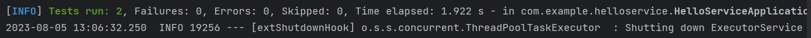

     单元测试代码如下：

     ~~~~java
     HelloController helloController = null;
     
     private final String ans = "{\"msg\":\"hello\",\"gid\":\"033\",\"members\":\"Corax, Begonia, Logician, LittleHu\",\"name\":\"结束乐队\"}";
     
     @BeforeEach
     void setUp() {
         helloController = new HelloController();
     }
     
     void requestForResp() {
         JSONObject jsonObject = (JSONObject) helloController.sayHello();
         assert jsonObject.toJSONString().equals(ans);
     }
     
     void requestFor429() {
         try {
             JSONObject jsonObject = (JSONObject) helloController.sayHello();
         } catch (TooManyRequestException e){
             return;
         }
         assert false;
     }
     
     @Test
     void availabilityTest() throws Exception {
         requestForResp();
     }
     
     @Test
     void currentLimitTest() throws Exception {
         for(int i = 0; i < 10; i++) {
             requestForResp();
         }
         for(int i = 0; i < 10; i++) {
             requestFor429();
         }
     }
     ~~~~

     两个测试分别测试了单次请求内容是否正确，以及多次请求是否能得到429的错误结果

   - 镜像构建阶段：根据仓库中具有的`Dockerfile`构建镜像文件，标签为当前流水线的构建ID，并标记为`harbor`镜像仓库镜像

   - 镜像上传阶段：首先根据小组的账号登录harbor.edu.cn，然后上传镜像，即可在harbor镜像仓库中看到上传的镜像

     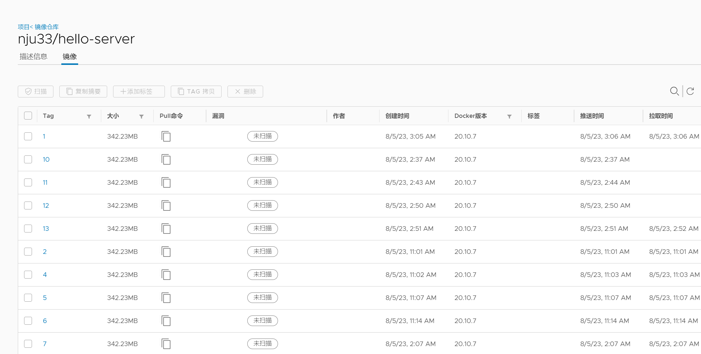

2. 从节点：

   - 克隆配置文件阶段：先登录p站😊以访问外网，然后从gitee仓库的main分支fetch代码，并通过`sed`将Kubernetes编排文件中所有的`{VERSION}`替换为`${BUILD_ID}`
   - 部署阶段：首先根据小组的账号登录harbor.edu.cn，然后拉取镜像主节点上传的镜像，进行部署
   - 监测程序：配合后续Prometheus采集需要，将在后续说明

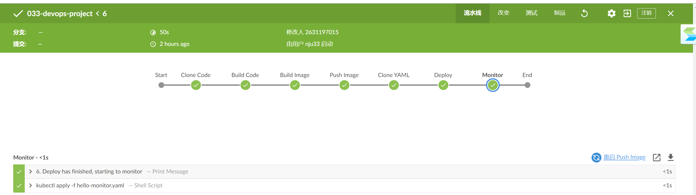

#### 提交仓库自动触发流水线

由于`Webhook`的原理是当仓库接收到提交之后就向服务器发送一个请求，要求服务器进行流水线构建，但由于服务器不具备公网ip，所以该功能无法实现🙁，或者可以定时更新，但也不满足要求

### 扩容场景

#### Prometheus采集监控指标

~~~~yaml
apiVersion: monitoring.coreos.com/v1
kind: ServiceMonitor
metadata:
  labels:
    k8s-app: hello-server
  name: hello-server
  namespace: monitoring
spec:
  endpoints:
  - interval: 30s
    port: tcp
    path: /actuator/prometheus
    scheme: 'http'
  selector:
    matchLabels:
      app: hello-server
  namespaceSelector:
    matchNames:
    - nju33
~~~~

jenkins流水线根据上面的yaml文件部署monitor之后，即可通过 http://172.29.4.18:32364/actuator/prometheus 查看监控指标

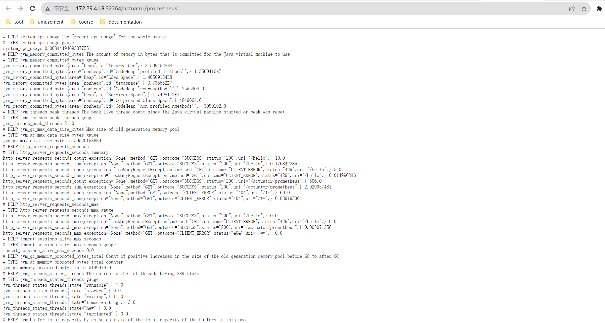

其中的32364端口通过ssh登录服务器后使用命令`kubectl get service -n nju33`查看映射端口

同时也可以通过 http://172.29.4.18:30083/targets 进行查看

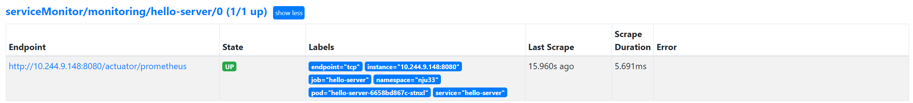

#### Grafana定制应用监控大屏

在import中输入以下JSON文件（由于太长还是直接在链接中查看吧）

http://172.29.4.18:31237/d/0GjqLMe4k/nju33-hello-server?from=now-5m&to=now&orgId=1&refresh=5s&editview=dashboard_json 创建定制仪表盘（注意其中有的内容是定制化的）

然后即可在Grafana平台上查看监控信息：

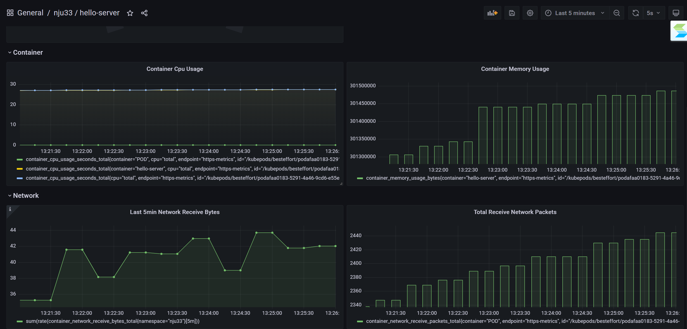

#### 压测并观测监控数据

打开`Apache Jmeter`，配置如下：

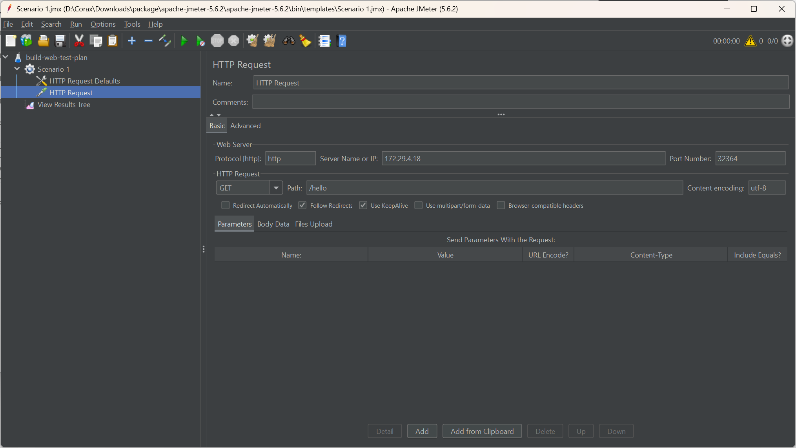

然后调整压力测试次数为5线程，每秒10次，持续5秒，点击运行测试，查看测试结果

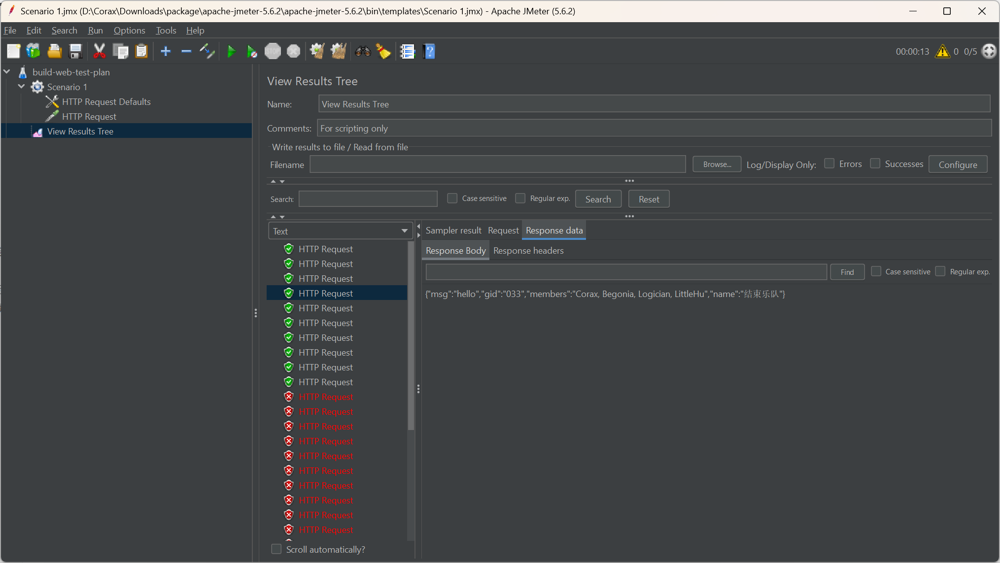

前10条请求成功，后续请求都收到了429的错误码，说明限流成功，查看Grafana监测结果也发现了各指标存在比较明显的上升

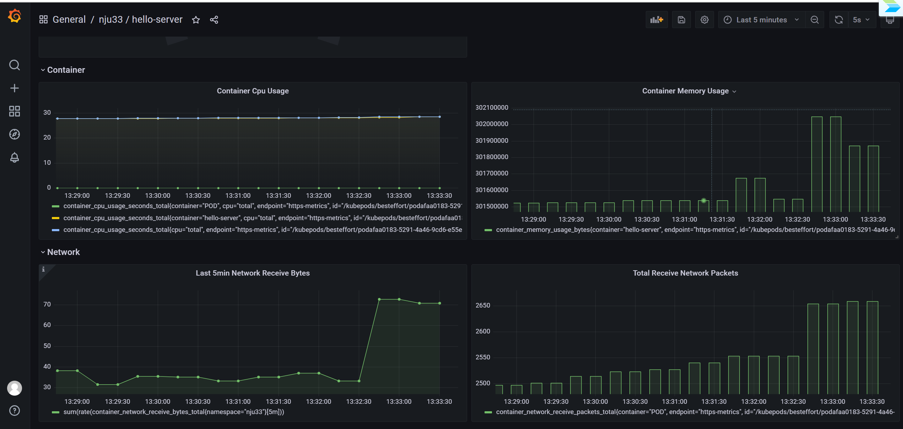

#### 扩容并再次观测

在`hello-deployment.yaml`中将节点数更改为3，（这里也可以更改以下限流的指标体验一下滚动发布）push到远程仓库之后重新构建流水线，等待节点就绪后再次压测，观测结果如下：

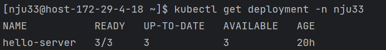

由于尚未进行统一限流，可以看到成功的请求数得到了提升

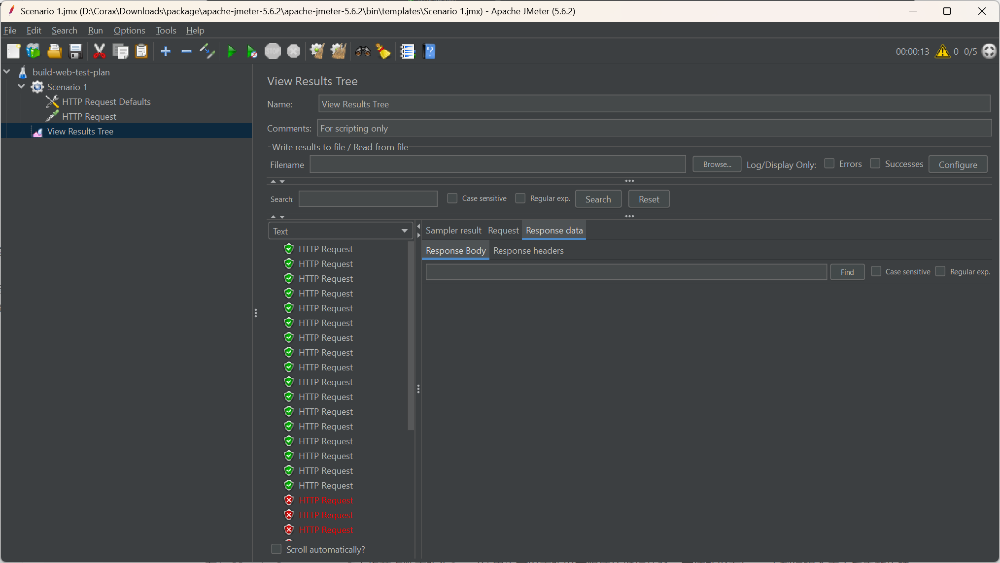

同时在Grafana中观测，可以看到出现了另外2个container曲线，并且每个container的上升都更加平缓

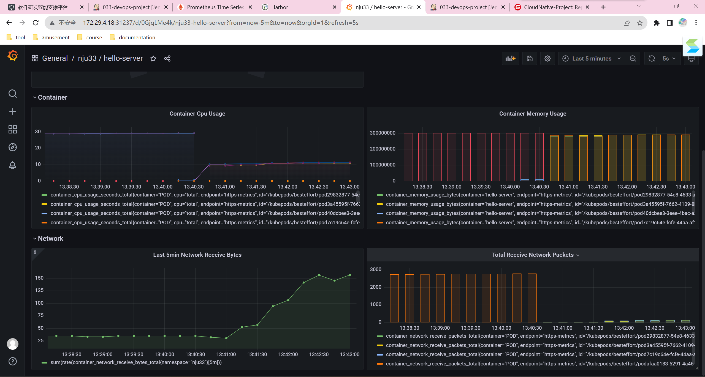

#### 自动扩容

~~~~yaml
containers: HelloContainer
  helloContainer:
    name: cpu
    container: hello-server
    target:
      type: Utilization
      averageUtilization: 60
~~~~
定义Pod规约时，利用如下命令创建HPA

~~~~ cmd
kubectl autoscale deployment php-apache --cpu-percent=50 --min=1 --max=10
~~~~

此时依照yaml中配置文件设置，HPA控制器会对目标对象执行扩缩操作以确保所有的Pod中`hello-service`容器的平均用量为60%。